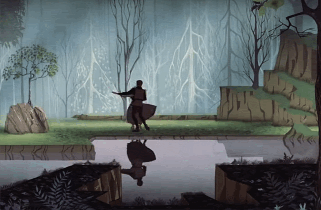
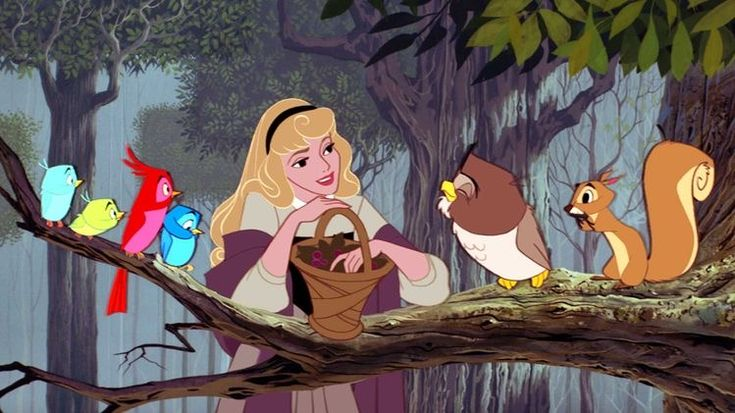

<h1> 🧸 Welcome to Sani's space </h1>

<h3><i>"Alis Volat Propriis" · She flies with her own wings.</i></h3>

## ✦ About Me ᯓ★
Hii, I'm **Sani** 💛

An IT student interested in **software development, web creation, and cybersecurity**. Outside of coding, you'll probably find me:

* ‧₊˚♪ **Listening to EXO** — *We Are One!* ✗♡✗♡ 
* **Learning Mandarin (HSK)**
* 🀢 **Learning Mandarin (HSK)** *Step by step, character by character.*
* 📽 **Watching mystery and historical dramas** *Always trying to solve the puzzle.*
* 🕮 **Exploring Chinese dynasty history** *Fascinated by the stories of the past.*

Always curious, always learning, and always building something new.
> 你只能活一次。我的观点是，只要你活着，你就该尽兴。
> *(You only live once. My view is, as long as you are alive, you should live to the fullest.)*

---

## Languages & Tools I Have Placed My Hands On

### Web Development & Databases

  
  
  
  

### Core Programming & Frontend

  
  
  
  

### Cyber Security & Analysis Tools

  

---

